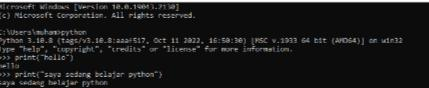
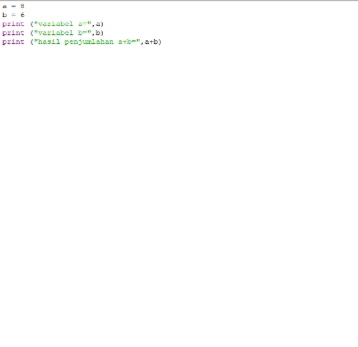
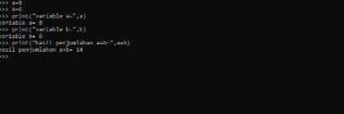
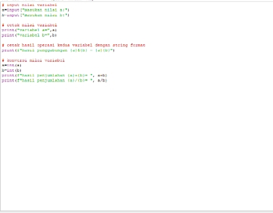
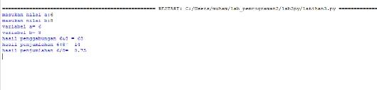
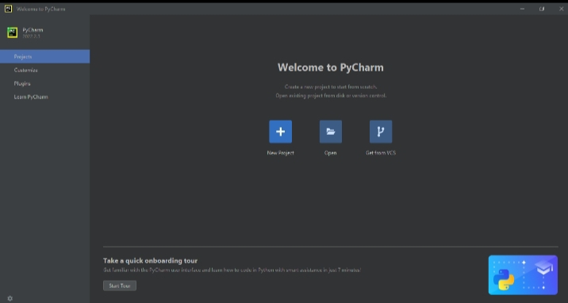
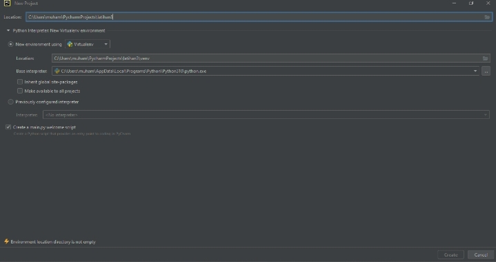
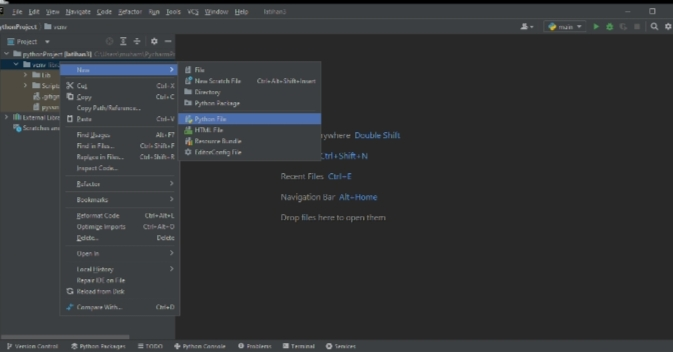
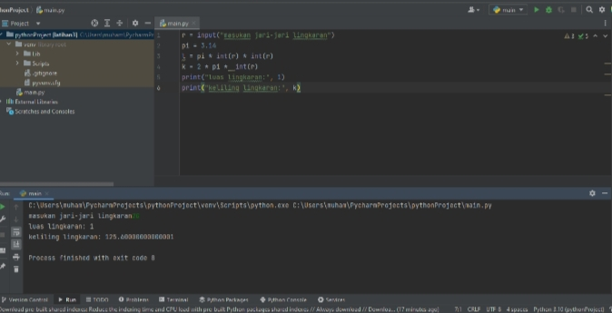

# PROSES / LANGKAH-LANGKAH PRATIKUM

## LATIHAN 1

### - Menjalankan tulisan "Hello" dilayar
### - Menampilkan tulisan "Saya sedang belajar python" dilayar

## LATIHAN 2

### - Menjumlahkan dua buah variabel bilangan menggunakan variabel a dan b
####   - Mendenifisikan variabel a dengan nilai 8
####   - Mendenifisikan variabel b dengan nilai 6
####   - Mencetak nilai variabel a dan b 
####   - Mencetak hasil penjumlahan a+b

## LATIHAN 3

### - Menjalankan IDLE
####   - Membuat file baru dengan nama *latihan3.py* (pastikan lokasi file pada folder lab2py pada direktori anda)
####   - Menggunakan fungsi *input* untuk mengambil nilai variabel dari keyboard

 
## Langkah-Langkah Mengggunakan PyCharm

#### - Jika belum terinstal, silahkan download di https://www.jetbrains.com/pycharm/
#### - Setelah selesai instalisasi, buka *PyCharm*
#### - Membuat laman kerja baru dengan menekan (+) atau Create New Project

## Virtual Environment

## Menambahkan File Baru

## Menjalankan Program

